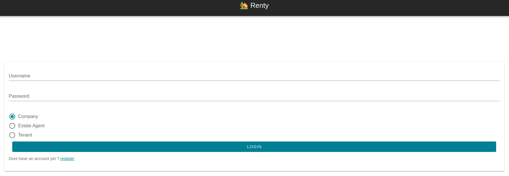
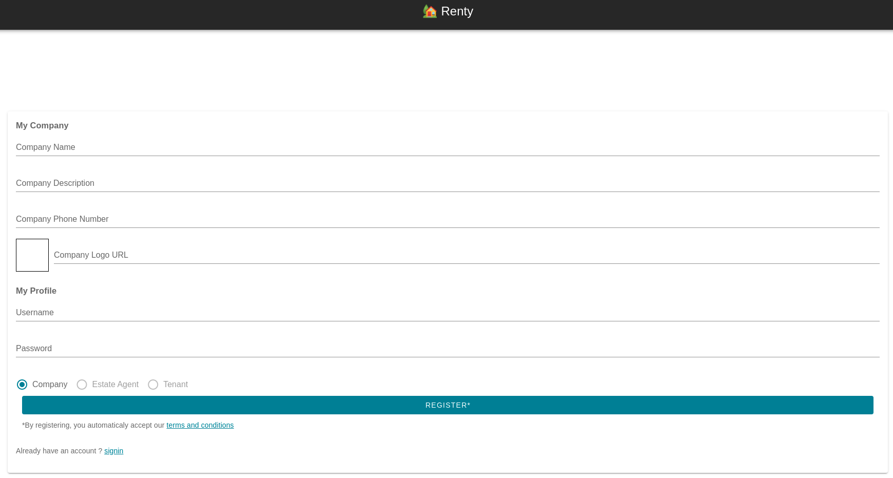
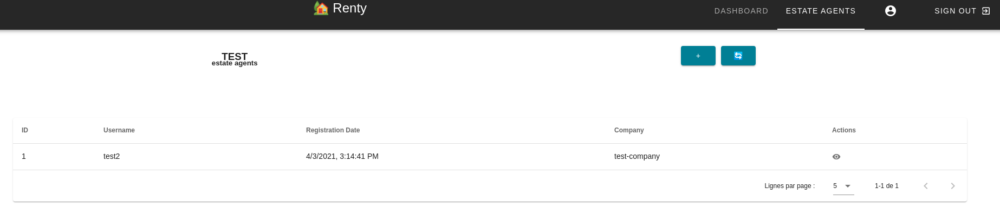

# Documentation Agence Immobiliére

> Renty Real Estate Management App

- [Documentation Agence Immobiliére](#documentation-agence-immobiliére)
  - [Comment ...](#comment-)
    - [Créer le profil de son agence](#créer-le-profil-de-son-agence)
    - [Ajouter ses agents immobilier](#ajouter-ses-agents-immobilier)
    - [Ajouter les propriétés sous gestion](#ajouter-les-propriétés-sous-gestion)
    - [Conditions d'utilisations](#conditions-dutilisations)

## Comment ...
### Créer le profil de son agence

En dessous du bouton "Sign In" se trouve le bouton "Register", veuiller cliquer dessus.

Cocher la case "Company".

Vous êtes inviter à remplir le formulaire suivant (nous vous conseillons de lire les termes et les conditions d'utilisation de notre site avant de poursuivre, pour se faire cliquer sur "terms and condition" en dessous du bouton "Register") : 

Une fois le formulaire rempli, vous pouvez de nouveau cliquer sur le bouton "Register"

Vous êtes alors redirigé vers votre tout nouveau tableau de bord (Dashboard) :

### Ajouter ses agents immobilier

Lorsque vous êtes connecté avec le compte de votre entreprise, vous pouvez cliquer sur l'onglet "Estate Agents" qui vous amènera sur cette page :

Vous devez alors cliquer sur le bouton "+" pour créer le compte de votre agent immobilier. Un nouveau formulaire apparaît :

Vous le verrez ensuite apparaître dans la liste de vos agents.
### Ajouter les propriétés sous gestion

TO DO

### Conditions d'utilisations

TO DO