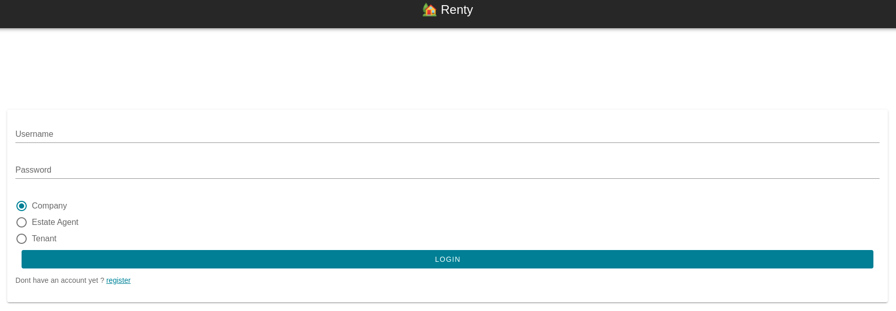

# Documentation Locataire / particulier

> Renty Real Estate Management App

- [Documentation Locataire / particulier](#documentation-locataire--particulier)
  - [Comment ...](#comment-)
    - [Créer son profil locataire](#créer-son-profil-locataire)
    - [Informations sur son logement](#informations-sur-son-logement)
    - [Modifier son mot de passe](#modifier-son-mot-de-passe)
    - [Gérer ses informations](#gérer-ses-informations)
    - [Conditions d'utilisations](#conditions-dutilisations)

## Comment ...

### Créer son profil locataire

En dessous du bouton "Sign In" se trouve le bouton "Register", veuiller cliquer dessus.

Cocher la case "Tenant".

Vous êtes inviter à remplir le formulaire suivant (nous vous conseillons de lire les termes et les conditions d'utilisation de notre site avant de poursuivre, pour se faire cliquer sur "terms and condition" en dessous du bouton "Register") : 

TO DO (image) 

Une fois le formulaire rempli, vous pouvez de nouveau cliquer sur le bouton "Register"

Vous êtes alors redirigé vers votre tout nouveau tableau de bord (Dashboard) :

TO DO (image)
### Informations sur son logement

TO DO
### Modifier son mot de passe 

TO DO
### Gérer ses informations

TO DO
### Conditions d'utilisations

TO DO